<h2>🍫 Descripción general:</h2>
 
Durante esta actividad se realiza una exploración de datos en SQL Server y un dashboard de Power BI para descubrir tendencias en un dataset de ventas de chocolate. Las consultas realizadas incluyen análisis de ingresos, costo unitario de productos, tasas de retención mensual de clientes y crecimiento en ventas, así como el Valor de vida del cliente (CLV) con análisis de cohortes.</a>  
Conceptos clave:  </b>
  • ARPU: Ingreso promedio por usuario.  
  • Tasa de retención: Calcula cuántos clientes permanecen con nuestro servicio o producto y cuánto dinero generan.  
  • Tasa de crecimiento: Cuánto crecen las ventas respecto al mes o año anterior.  
  • CLV: (Customer lifetime value) Valor de vida del cliente, en este ejercicio el CLV se determina con un análisis de cohortes. El análisis de cohortes es una técnica que observa el comportamiento de usuarios que comenzaron su registro o consumo de cierto producto o servicio en el mismo mes y sigue su evolución en el tiempo.
  
<h2>⚙️Tecnologías: </h2>
 
    • SQL Server  
    • Microsoft Power BI 
  

<h2>🖇️ Fuente: </h2> 
https://www.kaggle.com/datasets/ssssws/chocolate-sales-dataset-2023-2024?select=calendar.csv
 
 
 
<h2>📊 Actividades: </h2>
 
  • Definición de base de datos e importación de datos. 
  • Consultas para extraer cálculos de precios y métricas. 
  • CTE y funciones de agregación.  
  • Comparación de resultados en Power BI.  
 
 
<h2><b></b>Exploración en Power BI</b></h2>
 
Resultados del dataset, a primera vista los ingresos y costos están casi a la par, generando muy bajas ganancias y siendo esto perjudicial para el negocio. 
  

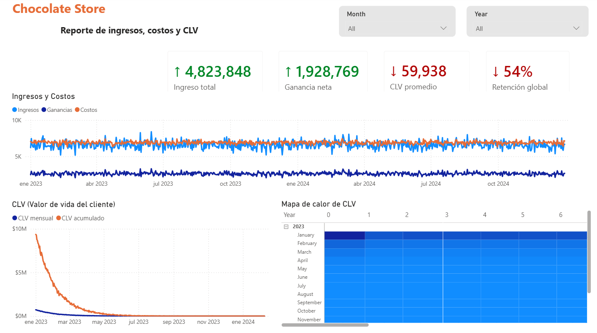
   
<b>Resultados de consultas con SQL Server para recalcular ingresos, costos, y otras métricas. Ahora los ingresos están por arriba de los costos.</b>  
Cada una de las tarjetas indica en color verde (ganancias) o rojo (perdidas) la comparación con el mes anterior de las métricas.  
El mapa de calor refleja el valor mensual del CLV. Las columnas indican el número de meses desde que el cliente ha realizado su primera compra (compras del mismo mes obtienen el valor 0, compras desde hace un mes, 1 y así sucesivamente hasta completar 24 meses -periodo enero 2023 a diciembre 2024), y las filas indican las fechas cohorte, periodo en que se ha llevado a cabo el registro o primera compra de los clientes (periodo enero 2023 a febrero 2024). Así, podemos comprender que el periodo con mayor CLV es de enero a agosto 2023.
  

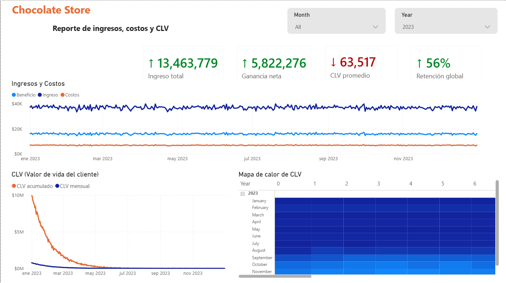
  
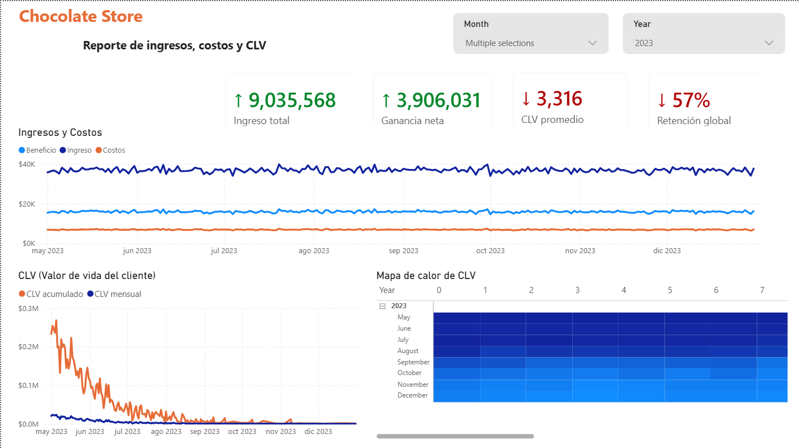
  
<h2><b></b>Exploración en SQL </b></h2>
  
▫️Ingreso y ganancias por país y tipo de tienda  

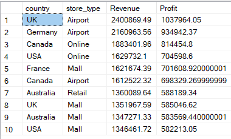
   
▫️Las semanas de mayor ingreso (iniciando los días lunes)  

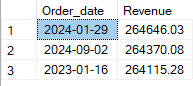
   
▫️Clientes más frecuentes durante la semana de mayor ingreso   
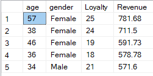
   
▫️Costo unitario por producto   

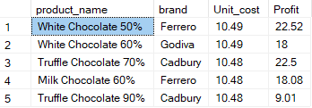
   
▫️Conteo de clientes registrados  
Se realizó una columna de ajuste de fechas (adjusted_join_date)  ya que algunos clientes contaban con fechas de registro posteriores a su primera compra.  
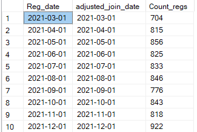
   

▫️Tasa de retención mensual  
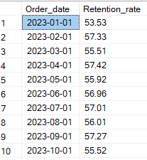
   
▫️Tasa de crecimiento mensual en ventas  

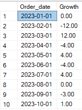
   
▫️CLV Customer Lifetime Value (Valor de vida del cliente)  

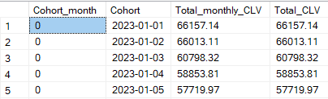
   
▫️Organización del número de clientes por ingreso  

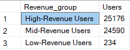
   
<h2>🔶 Observaciones generales:</h2>
 
• Los países con más ingresos han sido Reino Unido y Alemania. Las tiendas en aeropuertos aportan más ingresos y beneficios al negocio. 
• Las semanas con más ingresos han sido a finales de enero y septiembre de 2024.  
• A finales de enero de 2024, los clientes más frecuentes tenían rangos de edad desde 34 a 57 años y fueron en su mayoría mujeres, sin embargo, los hombres son los clientes que cuentan con más membresías. 
• El ARPU es de 538.96 unidades monetarias. 
• Los productos con mayor costo y ganancias son White Chocolate 50% de Ferrero, White Chocolate 60% de Godiva y Truffle Chocolate 70% de Cadbury. 
• Los periodos con más registros de clientes fueron  diciembre 2021 y marzo 2022.  
• Las tasa de retención supera el 50% y sigue una tendencia de subida y bajada con los meses. 
• De la misma manera, las tasas de crecimiento del negocio también siguen una tendencia de subida y bajada con los meses. 
• El CLV disminuye con el paso del tiempo, algunos clientes disminuyen sus compras o ticket promedio. 
• EL grupo de clientes que más ingresos atrae al negocio es también el más numeroso.
 
